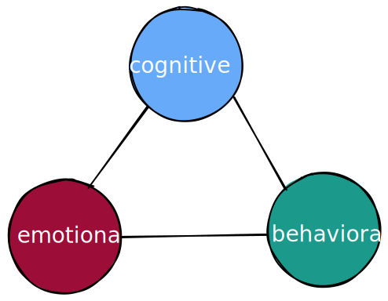
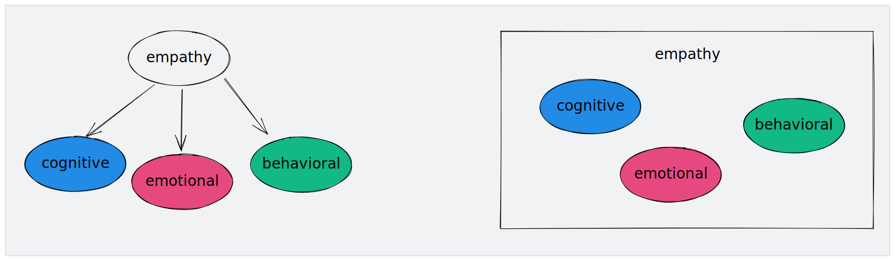

 

[同理心的定義](../同理心的定義)中曾提到，同理心的的定義多元，目前普遍接受同理心是一個包含多元向度（多元能力）的概念（或是能力）。

在這樣子的看法底下，我很自然地認為，這些不同的次向度的能力應該彼此之間是正相關的，因為都被一個共通的潛在構念所影響（圖二左）。

 

不過，Klöckner等人（2022）的研究卻發現，認知上的同理（JSE測量）跟行為上的同理表現（以VR-CODES測量）只有部份相關。更明確地說，JSE的分數高低的差異，只在醫師（實習生）的非口語行為表現上看到差異，口語同理行為則和JSE分數高低無關。

如果這些不同的次向度之間的關係並不是那麼緊密的話，也許同理心比較像是一種籠統的名詞（collective term），將許多不同的能力籠統地括在一起說（圖二右）。這些不同的能力之間不必然有正相關。

如果是這樣子的話，那麼要測量同理心將會更加的困難，因為不同的能力之間如果不一定有關係的話，那麼就沒有辦法只測量其中一項能力而去推估其他能力，這樣就不同測那麼多不同的次能力；相反的，可能要測量許多不同的能力，才可以形成對於同理心能力的印象。

不過，Klöckner等人（2022）只有15個人的資料，樣本數其實很少，這個結果是否是穩定的還需要更多的研究。只是，現有的同理心測量，絕大多數都是自評的認知同理。要有更多探討不同的同理向度間的關係，可能還要有較有效的情緒同理、行為同理的測量工具出現。

### 參考文獻

Klöckner, C. C., Gerbase, M. W., Nendaz, M., Baroffio, A., & Junod, N. P. (2022). Relationship between self-reported cognitive and behavioural empathy among medical students. Patient Education and Counseling, 105(4), 895–901. https://doi.org/10.1016/j.pec.2021.07.053
