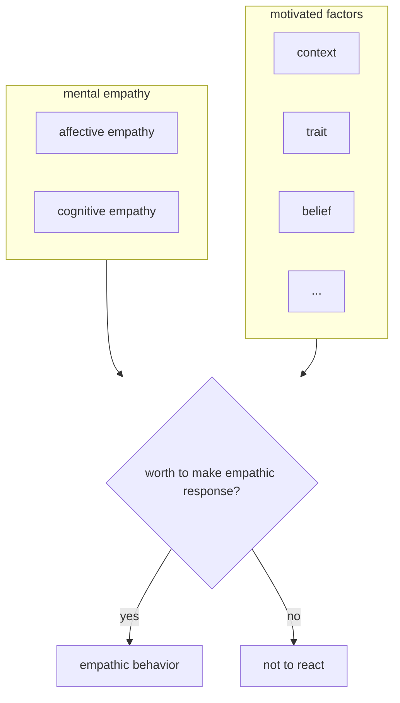

# 同理心的複雜定義以及同理行為

> As others (e.g., Wispé, 1986) have pointed out, there are nearly  as many definitions of empathy as there are scientists who study  this phenomenon. (Zaki, 2014)

先前在[[同理心的定義]]討論了同理心的定義，而在回顧更多文獻之後發現同理心的定義真的在不同的文獻都有些許的不同。雖然如此，大多還是包含情感上的同理（affective empathy）以及認知上的同理（cognitive empathy）。前者指的是對於他人情緒經驗能夠有所感的能力，而後者則是指能夠理解他人的感覺、想法的能力，有的人認為這個和觀點取替的能力相同。

而同理行為大部份都出現在醫學、護理相關的同理心文獻當中，而鮮少在心理學的文獻中被提及，有很明顯的領域差異。

我這邊心智上的同理（包含情感以及認知同理）以及同理行為分開，因為從文獻上以及經驗上，即使在心智上對他人產生同理心並不一定最後會付諸行動而產生同理行為。

我認為，同理行為產生的機率，會受到心智上的同理產生的同理強度的影響，以及受到先前在[[motivated model of empathy]]當中提到影響動機相關的情境因素以及個人特質的調節。

在這個假設之下，若要提升同理行為的產生，一方面是增加心智同理的強度（這個有辦法增加嗎？）而另一方面則是透過影響動機可能的因素來進行了。

這樣子的架構也很符合認知心理學當中的雙歷程認知架構，應該值得一試！