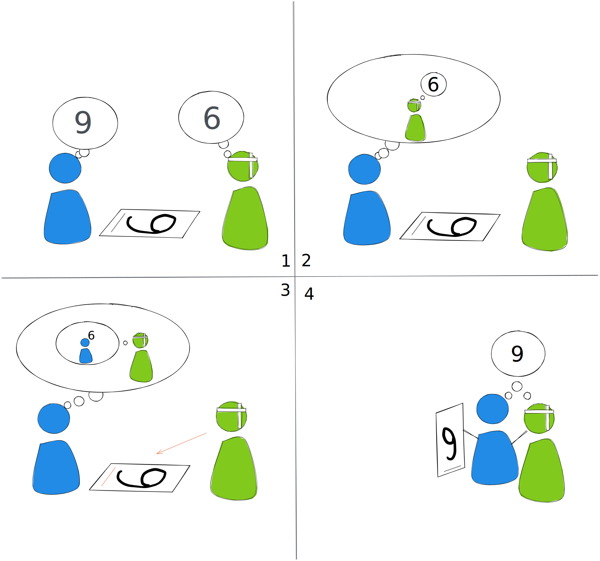

# 同理的困難

要做到同理有許多的困難

1. 要先體認到不同的人有不同的角度與觀點，所以會有不同的看法以及預期。
2. 在互動的過程需要理解或是辨認出他人現在的想法或是感受是什麼？
3. 除了理解到他人現在的想法外，還要理解對方「為什麼」會這麼想。能夠從對方的觀點來思考。才可以知道衝突發生的徵結點。
4. 在可以從對方的觀點來思考之後，你才有辦法選擇以及做出適當反應。因為你要考量到反應之後，對方可能有什麼樣的反應。

每一步，都需要假設性思考、推理的能力。這都不是簡單的事情，以下再進一步說明

## 知道每個人都是不一樣的

每個人都是不一樣的，每個人都知道，但卻很常忘掉。又或者是說，我們可能很常用其他的方法來解釋其他人和我們的不一樣。

我這邊的不一樣指的是觀點的不同。這個不同有兩種來源，一個是較長期穩定的，基於每個人的成長背景、知識，以及長期和這個世界互動後形成對於世界認識的基模或者是習慣，這些組合成我們看待世界的觀點，影響著我們對於看到的東西所做出的詮釋以及思考歷程。另一個是個人當下的狀態，情緒、身體狀況（例如身體某個部位在痛、昨晚沒睡飽），也會影響當下對世界的看法，以及如果和世界互動的選擇。如果用數學式來看的話，也許會是像這樣吧

$$現在看世界的觀點 = 長期養成的觀點 + 當下的狀態$$

基於上述理由，對於同樣的事情不同的人有著不同的觀點或是感受，是很正常的，因為每個人的背景知識不一樣，當下的身體狀況也可能不一樣。

就像是上圖中的第一格，兩個人從各自不同的觀點來看同一個事物，一邊看起來是9，而另一邊看起來是6。如果雙方不知道彼此的觀點有所不同，那麼很容易都認為對方應該也要看到和自己相同的數字。甚至在發現對方和自己看得不一樣時，會覺得對方一定是錯的，或是對方有問題，才會和自己不一樣。

**知道其他人可能和自己不同，才保有雙方繼續互動下去的彈性**，否則在發現對方所想的和自己心裡所想的有所不同時，先入為主的認為對方有問題，接下來如果需要雙方達成共識，是接近不可能的事情。

## 理解或是辨認出他人現在的想法或是感受

在明白每個人的觀點都可能有所不同之後，接下來便是要實際理解到底對方的想法是什麼？畢竟許多人是有經過社會化的，外顯出來的和內心所想的不一定會相同。而在醫療的領域當中，有時候會遇到的情況是病人受限於身體狀況，可能也很難將自己的想法或是感受表達地很清楚。有些時候需要藉由一些身體語言或是引導問答，才有辦法釐清。那才有辦法像圖中第2格一樣，掌握到對方從他的角度看到的數字，是6。

## 理解對方「為什麼」會這麼想

光是知道對方現在實際的想法或是感受，那只是同理的初步動作。去理解到對方「為什麼」會有這樣的想法或是感受，我認為才算是進到的同理的核心。因為這必須要跳出自己的思考的角度和框架，試著從別人的角度去思考。這需要一些抽象推理能力，或是想像力，才有辦法將自己想像為他人，用另一套看世界的方法來思考。

不過，若是自己曾有過切身經驗，也許會比較簡單，但也可能有反效果。因為若對方和自己在相似的經驗當中是依循著相同的思考模式的話，你可能便可以理解對方為什麼會這麼想。但，每個人在面對相同的事件是可能有不同的反應或是思考模式的。甚至是雖然有相同的反應，但思考模式是完全不同的。

因此，這個部份是同理過程當中相當重要，但也十分困難的一步。若跟對方沒有基本的認識，基本上是很難有辦法去理解到對方為什麼會有這樣子的想法或是感受，只能夠從自己過去的經驗或是知識來去做猜測（要冒著猜錯的風險）。

## 做出適當反應

如果做到了上一步，那麼便自然而然的可以去做出適當的反應。

就像是圖中第3格，我們理解到對方之所以會將數字看作是6，是因為他從他的角度來看就會是6。而且他似乎沒有注意到數字上有一條底線，顯示9可能才是這個數字的正確答案。

如果知道對方是因為角度的關係，並且可能忽略掉了細微的底線。這時可以邀請對方到我這邊來，並指出底線的存在。又或者是我幫對方將數字掉頭，讓他可以看清楚底線。如果再多考慮到對方受傷行動不便（我應該有畫得很明顯吧？），後面這個做法會是更好的做法。

當還沒有辦法完成上一步，理解對方為什麼會這麼想時，最好不要輕舉妄動，這時最佳的行為準則是想辦法獲得更多的訊息來幫助自己理解對方的思考模式。