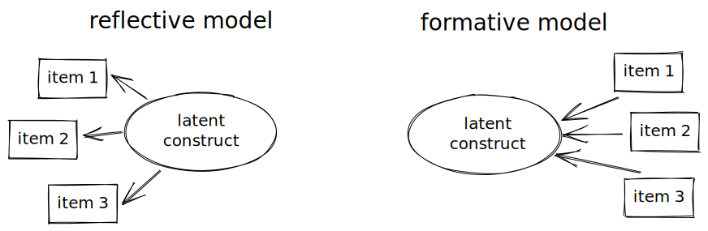

# 測量一般人的同理心量表

先前整理了[[測量一般人的同理心量表]]，但這些量表是屬於reflective model或是formative model當時並沒有很詳細地去進行判斷。

根據Coltman等人（2008）[[coltmanFormativeReflectiveMeasurement2008]] 的整理，這兩種measurement model的差異可以從幾個地方來檢視（見[[如何區分工具是reflective model或是formative model]]）。因此，我也試著用這六點來檢視先前找到的15個測量工具。這六點可以分做理論上以及實務上考量的要點，而實務上的要點需要測驗的結果，若原始論文沒有提供，我也難以判斷。因此，這裡主要是以理論上考量要點做為判斷依據。


1. 要測量的構念的本質是否自然形成或是人為定義出來的
2. 所測量的項目（題目）與構念間的因果關係
3. 測量的項目的特性（可替代性）

在實際判斷時，最主要還是考慮第2點，項目與構念之間的因果關係。



例如，以[[Toronto Empathy Questionnaire]]裡面的題目為例：
> I enjoy making other people feel better

這是一個自評的量表，自我評量認為自己的同理心是高或低。如果心中的假設是同理心高的人較樂意去幫助他人，那也就是說，是同理心這個能力或是特質影響到是否能夠感受到他人情緒的表現。從這個角度來看，這題目無疑是屬於reflective model。因為「我的行為」是受到「我的能力」或是特質所影響的。這樣子來看，所有的自評量表都是reflective model：

我的同理心 → 幫助他人行為頻率


不過，若是場景換成我們要去評論別人的同理心高低時，情況就複雜的多了。因為知人知面不知心，通常我們只從這個人的行為表現來看，他是否很常做出某些符合我們心中具有同理心的人的表現（例如很常關懷他人）。這時候助人行為與同理心的因果可以是：因為他很常幫助他人，所以我覺得這個人很有同理心。但也可以是因為這個人是有同理心的人，所以可以看到他很常幫助他人。

這樣看來，在評論他人的同理心高低時，似乎會有兩種measurement models都可以，端看研究者心中的假設，這樣子的感覺。然而，仔細想想，這兩種model所測量的潛在構念有些許的不同：

reflective model
**這個人的**同理心 → 我觀察到幫助他人行為頻率

formative model
**我感覺到的**這個人的同理心 → 我觀察到他幫助他人的行為頻率

因此，在評論他人的同理心高低時可能可以有兩種角度。

我找到的主要有三個測驗是評論他人的同理心
1. [[Perceived empathy in online community]]。這個題目都在問作答者感受到的感受，所以我覺得應該只有formative model
2. [[Griffith Empathy Measure]]由父母來評量小孩的行為，可以由兩種角度來看。故我覺得可以是reflective或是formative。不過作者應該是認為該量表是reflective model，從分析的方法上來判斷的話。
3. 另外還有[[Other Dyadic Perspective-Taking scale]]，這個我一直找不到題目，無法判斷。

## 測驗清單

```dataview
table model as 模型, target as 目標對象, 測量方式
from #empathy & #measurement & #inventory & -#blog
where forclinical != true
```

| File17                                                                                                                                                                                               | 模型                   | 目標對象            | 測量方式 |
| ---------------------------------------------------------------------------------------------------------------------------------------------------------------------------------------------------- | -------------------- | --------------- | ---- |
| [interpersonal reactivity inventory](app://obsidian.md/tasks%20and%20measurements/empathy%20measurement/interpersonal%20reactivity%20inventory.md)                                                   | reflective           | 一般人             | 自評   |
| [empathy scale for teachers (EST)](app://obsidian.md/tasks%20and%20measurements/empathy%20measurement/empathy%20scale%20for%20teachers%20(EST).md)                                                   | reflective           | teacher         | 自評   |
| [The cognitive, affective and somatic empathy scales](app://obsidian.md/tasks%20and%20measurements/empathy%20measurement/The%20cognitive,%20affective%20and%20somatic%20empathy%20scales.md)         | reflective           | 一般人             | \-   |
| [Hogan's empathy scale](app://obsidian.md/tasks%20and%20measurements/empathy%20measurement/Hogan's%20empathy%20scale.md)                                                                             | reflective           | 一般人             | 自評   |
| [Other Dyadic Perspective-Taking scale](app://obsidian.md/tasks%20and%20measurements/empathy%20measurement/Other%20Dyadic%20Perspective-Taking%20scale.md)                                           | 無題目可判斷               | 一般人             | 自評他人 |
| [Balanced Emotional Empathy Scale (BEES)](app://obsidian.md/tasks%20and%20measurements/empathy%20measurement/Balanced%20Emotional%20Empathy%20Scale%20(BEES).md)                                     | reflective           | 一般人             | 自評   |
| [Basic Empathy Scale (BES)](app://obsidian.md/tasks%20and%20measurements/empathy%20measurement/Basic%20Empathy%20Scale%20(BES).md)                                                                   | reflective           | *   青少年
*   一般人 | 自評   |
| [Griffith Empathy Measure](app://obsidian.md/tasks%20and%20measurements/empathy%20measurement/Griffith%20Empathy%20Measure.md)                                                                       | reflective/formative | 兒童              | 自評他人 |
| [Feeling and Thinking Scale](app://obsidian.md/tasks%20and%20measurements/empathy%20measurement/Feeling%20and%20Thinking%20Scale.md)                                                                 | reflective           | 兒童              | 自評   |
| [Multidimensional Emotional Empathy Scale](app://obsidian.md/tasks%20and%20measurements/empathy%20measurement/Multidimensional%20Emotional%20Empathy%20Scale.md)                                     | reflective           | *   一般人
*   青少年 | 自評   |
| [questionnaire measure of emotional empathy (QMEE)](app://obsidian.md/tasks%20and%20measurements/empathy%20measurement/questionnaire%20measure%20of%20emotional%20empathy%20(QMEE).md)               | reflective           | 一般人             | 自評   |
| [Perceived empathy in online community](app://obsidian.md/tasks%20and%20measurements/empathy%20measurement/Perceived%20empathy%20in%20online%20community.md)                                         | formative            | 一般人             | 自評他人 |
| [Questionnaire of Cognitive and Affective Empathy (QCAE)](app://obsidian.md/tasks%20and%20measurements/empathy%20measurement/Questionnaire%20of%20Cognitive%20and%20Affective%20Empathy%20(QCAE).md) | reflective           | 一般人             | 自評   |
| [short form Empathy Quotient](app://obsidian.md/tasks%20and%20measurements/empathy%20measurement/short%20form%20Empathy%20Quotient.md)                                                               | reflective           | 一般人             | 自評   |
| [青少年復原力量表](app://obsidian.md/tasks%20and%20measurements/empathy%20measurement/%E9%9D%92%E5%B0%91%E5%B9%B4%E5%BE%A9%E5%8E%9F%E5%8A%9B%E9%87%8F%E8%A1%A8.md)                                           | reflective           | 青少年             | 自評   |
| [Toronto Empathy Questionnaire](app://obsidian.md/tasks%20and%20measurements/Toronto%20Empathy%20Questionnaire.md)                                                                                   | *   reflective       | 一般人             | 自評   |
| [Empathy Quotient](app://obsidian.md/tasks%20and%20measurements/Empathy%20Quotient.md)                                                                                                               | reflective           | *   一般人         | 自評   |